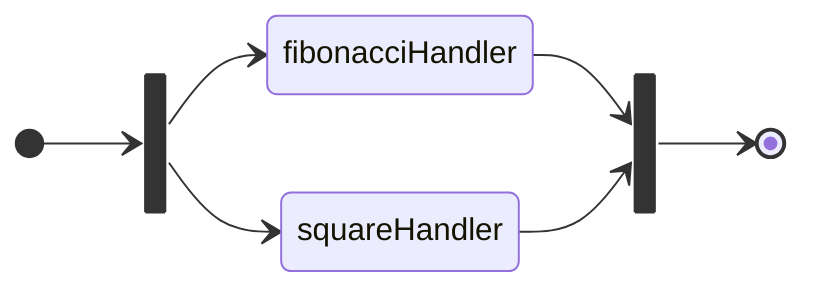
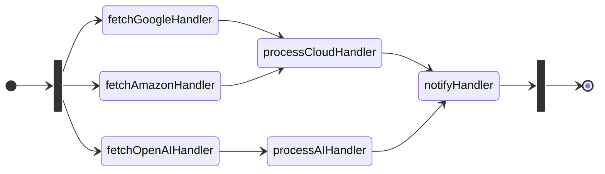

## Examples

### Parallel

[parallel/main.go](./parallel/main.go)



### Topological

[topological/main.go](./topological/main.go)



### Typed Store

[typed_store/main.go](./typed_store/main.go)

To read a value from `pipes.Store` we have to do the following:

```go
// data has type any
data, err := store.Read(ctx, handlerId)
if err != nil {
    return nil, err
}
```

In addition, we have to cast `data any` to target type:

```go
// result has original type
result, ok := data.(string)
if !ok {
    return nil, fmt.Errorf("invalid type: expected string, actual %T", data)
}
```

To get rid of this boilerplate, create `typedStore` interface with getter-like methods and proper target types.

```go
type typedStore interface {
	pipes.Store
	GetFetchHandlerResult(context.Context) (string, error)
	GetProcessHandlerResult(ctx context.Context) (map[rune]struct{}, error)
}
```

### Options

[with_options/main.go](./with_options/main.go)

Pass `pipes.Option[pipes.Store]` while register handler in `pipes.Runner[pipes.Store]`, for example to add timeout to `context.Context` for handler execution.

```go
func WithTimeout[S Store](timeout time.Duration) Option[S] {
	return func(next Handler[S]) Handler[S] {
		return func(ctx context.Context, s S) (any, error) {
			ctx, cancelFn := context.WithTimeout(ctx, timeout)
			defer cancelFn()
			return next(ctx, s)
		}
	}
}
```